# 인증 흐름 (로그인 · 세션 · 토큰)

> Mobile 앱이 Google ID Token 으로 로그인/자동 가입하고, 서버가 자체 JWT 세션을
> **Access Token(무상태) + Refresh Token(DB 상태)** 두 층으로 발급·회전·종료하는 전체 흐름.
> 코드만 봐서는 잡히지 않는 **정책과 큰 그림** 만 적는다.

## 목차

- [한눈에 보기](#한눈에-보기)
- [Part 1. 로그인 / 가입 (Google OIDC)](#part-1-로그인--가입-google-oidc)
- [Part 2. 세션 / 토큰 (Access + Refresh 회전)](#part-2-세션--토큰-access--refresh-회전)
- [예외 흐름 (공통)](#예외-흐름-공통)
- [트랜잭션 / 멱등성 경계](#트랜잭션--멱등성-경계)
- [향후 확장](#향후-확장)

## 한눈에 보기

핵심 멘탈 모델 하나: **"세션 통제는 전부 Refresh Token 쪽에 몰아넣고, Access Token 은 빠르게 흘려보낸다."**

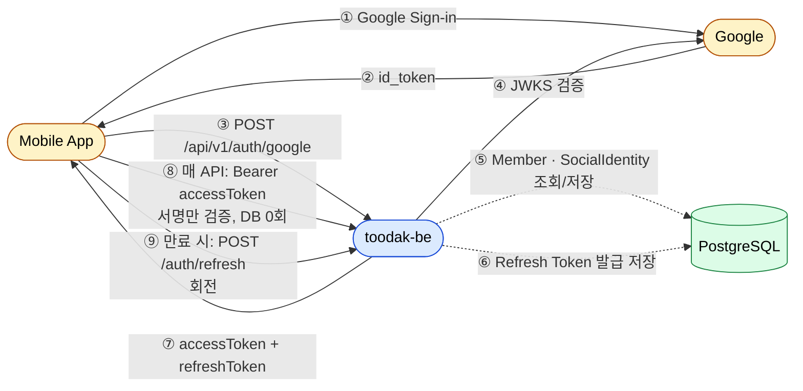

자주 일어나는 일(API 호출)은 가볍게, 가끔 일어나는 일(로그인·토큰 갱신)에서만 무겁게 검사한다.

---

# Part 1. 로그인 / 가입 (Google OIDC)

## 전체 시퀀스

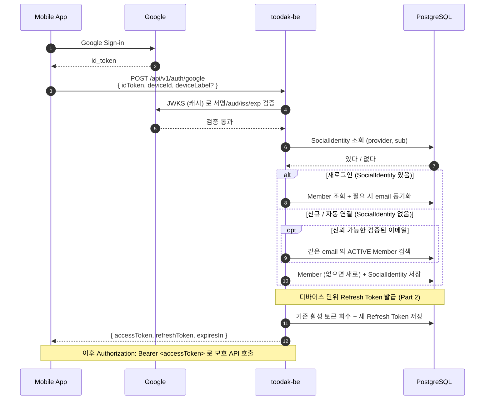

## 분기 결정

`(provider, providerUserId)` 가 시스템 전체 UNIQUE 이므로, **이 한 번의 조회로 "재로그인 vs 신규" 가 갈린다.**

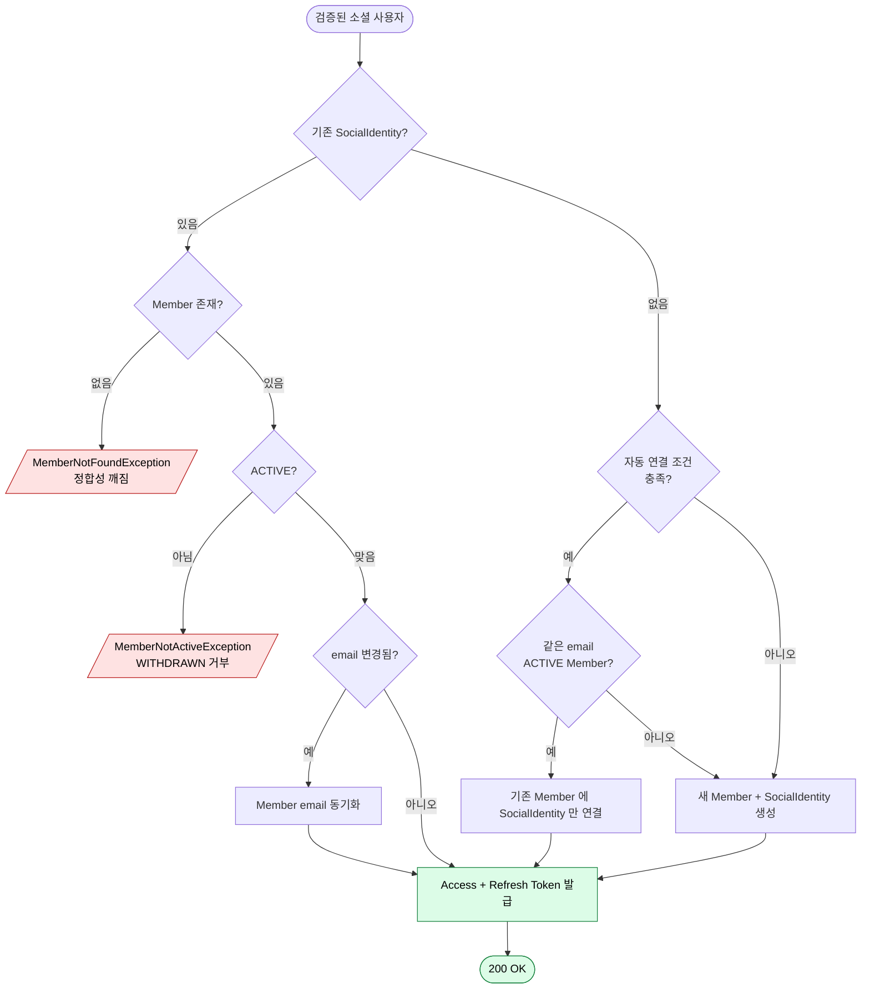

## 자동 연결 정책

신규 분기에서 같은 이메일의 기존 Member 에 새 SocialIdentity 를 자동으로 붙일지 결정하는 게이트.

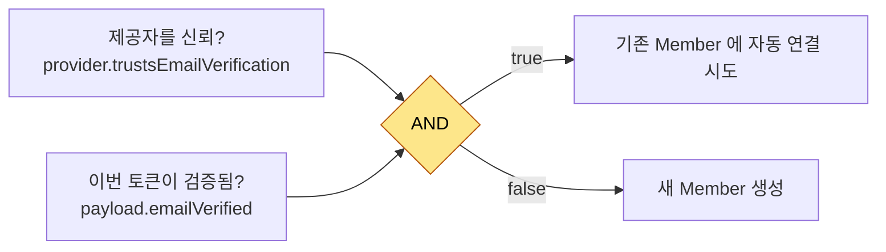

- **두 신뢰 층의 AND**:
  - `trustsEmailVerification` — "이 **소스(제공자)** 를 신뢰하는가" (제공자 단위 정책)
  - `emailVerified` — "그 소스가 **이번에 뭐라고 말하는가**" (토큰 단위 사실)
- 한쪽만 통과하게 두면, 신뢰 안 하는 제공자가 가짜 `verified=true` 를 보내거나, 신뢰하는 제공자라도 미검증 이메일로 다른 사람 계정과 합쳐질 수 있다.
- 정책을 바꾸려면 `Provider` enum 한 곳만 손대면 된다.

## 데이터 모델 (Member)

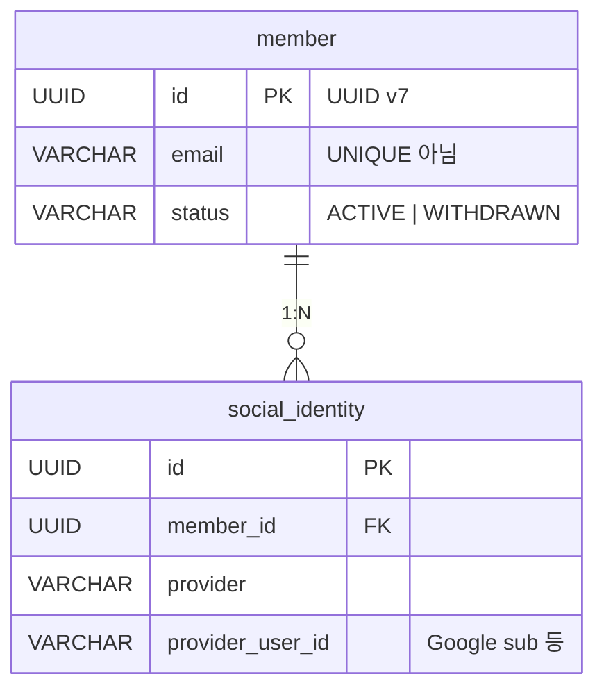

- **식별 키는 `(provider, provider_user_id)`**, email 이 아니다 — 이메일은 변동/공유 가능한 부가 정보.
- 그래서 `email` 에는 UNIQUE 를 걸지 **않고**, 동일 이메일 회원이 여러 명일 수 있다.

## Member 상태

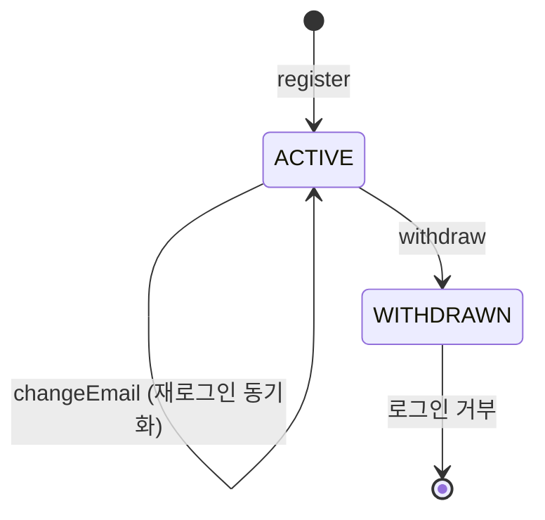

- 탈퇴는 soft delete — 데이터는 보존, 로그인만 막힌다.
- SocialIdentity 는 한 번 연결되면 첫 연결 시점 그대로 보존 (재로그인 시 갱신하지 않음).

---

# Part 2. 세션 / 토큰 (Access + Refresh 회전)

## 두 토큰의 역할 분담

| | Access Token | Refresh Token |
|---|---|---|
| 저장 | **저장 안 함** (DB·엔티티 없음) | `refresh_token` 테이블에 **해시만** |
| 검증 | 서명(HMAC-SHA256) + 만료만, **DB 0회** | `findByHash` 로 **DB 조회** |
| 수명 | 짧음 (`jwt.access-ttl` = **15분**) | 김 (`jwt.refresh-ttl` = **30일**) |
| 즉시 무효화 | **불가** (무상태) | 가능 (revoke) |
| 매 요청 비용 | 거의 0 | — (재발급 때만) |
| 통제 지점 | 없음 | 발급·회전·로그아웃·탈취 회수 |

사용자를 끊고 싶으면 Refresh Token 을 revoke 한다 — **다음 재발급부터 막힌다** (이미 발급된 Access Token 은 만료까지 살아있다, [향후 확장](#향후-확장) 참고).

## 발급 — 로그인 시 (디바이스 단위 단일 세션)

`LoginWithGoogleUseCase.issueRefreshToken` 이 발급한다. 정책은 **디바이스(`memberId + deviceId`) 당 활성 토큰 1개**.

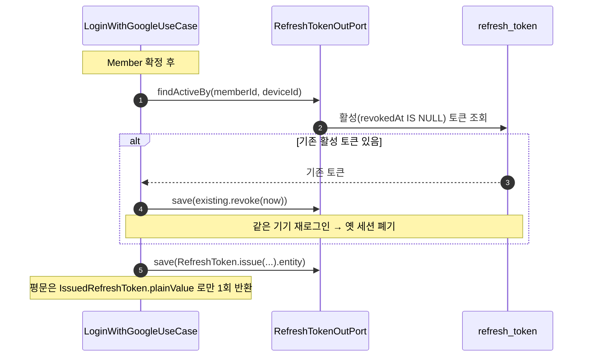

- 같은 기기에서 다시 로그인하면 기존 활성 토큰을 먼저 `revoke` 한 뒤 새로 발급한다 — 한 기기에 활성 세션이 둘 생기지 않는다.
- 평문 토큰은 `IssuedRefreshToken` 에 담겨 응답으로 **딱 한 번** 나가고, DB 엔 해시만 남는다.

## 회전 — 재발급 시 (`POST /api/v1/auth/refresh`)

`RefreshAccessTokenUseCase` 의 핵심. **기존 토큰을 폐기하고 완전히 새 토큰을 만든다** (기간 연장이 아니다).

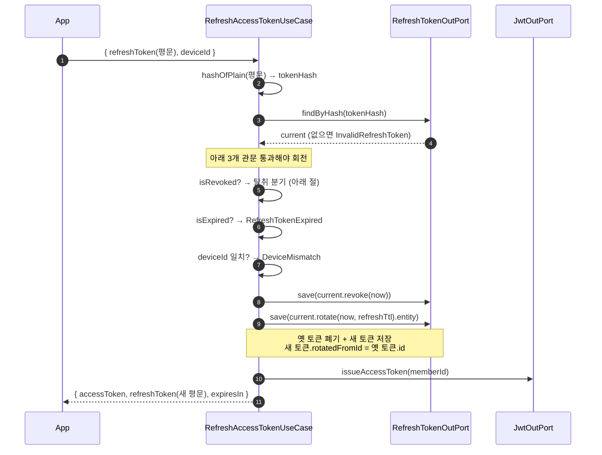

회전 1회로 DB 엔 토큰 레코드가 **2개**가 된다 — 폐기된 옛 토큰 + 활성 새 토큰. 둘은 `rotatedFromId` 로 연결돼 회전 체인을 이룬다.

`RefreshToken.rotate` 가 바꾸는 것 / 유지하는 것:

| 바뀜 | 유지 |
|---|---|
| `id` (새 UUID v7) | `memberId` |
| `tokenHash` (= 평문, 새 랜덤 32B) | `deviceId`, `deviceLabel` |
| `issuedAt` / `expiresAt` (TTL 갱신) | |
| `rotatedFromId` = 옛 토큰 id | |

> `rotate()` 의 반환 타입이 `RefreshToken` 이 아니라 `IssuedRefreshToken` 인 이유: 평문이 노출되는 객체임을 타입으로 강제해, UseCase 밖으로 평문이 새지 않게 한다. `issue()` 도 같은 타입을 반환하고, 평문이 없는 `revoke()` 만 `RefreshToken` 을 반환한다.

## 탈취 감지 — 폐기된 토큰 재사용

정상 클라이언트는 항상 **최신 토큰**만 들고 있다. 한 번 회전된 토큰은 `revokedAt` 이 채워지므로, **이미 폐기된 토큰이 다시 들어오면 = 누군가 옛 토큰을 훔쳐 썼다** 로 간주한다.

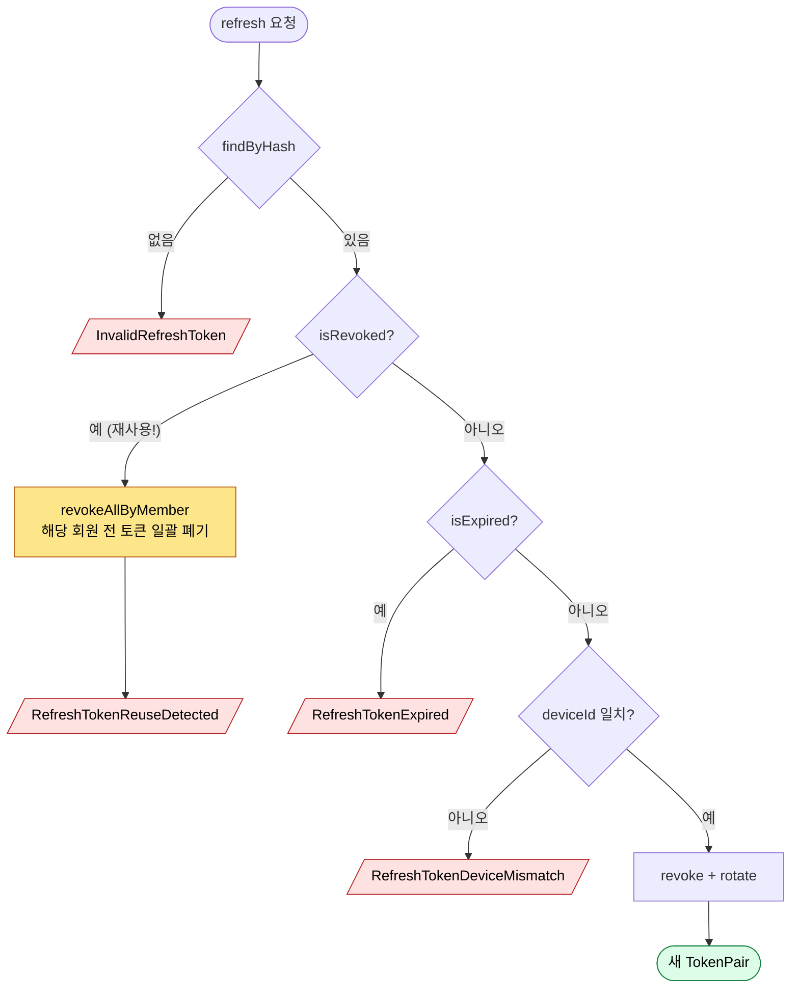

토큰 값을 매번 새로 발급하기 때문에 "옛날 값이 또 들어왔다" 를 잡을 수 있다. 같은 토큰의 만료만 연장하는 방식이면 이 탐지가 불가능하다 — **회전의 존재 이유가 곧 탈취 감지**다.

### 트랜잭션 미묘함: `noRollbackFor`

탈취 분기는 `revokeAllByMember` 로 **일괄 폐기를 먼저 하고** `RefreshTokenReuseDetectedException` 을 던진다. Spring 기본 정책은 `RuntimeException` 에서 롤백하므로, 그냥 두면 **방금 한 일괄 폐기까지 롤백돼 무의미**해진다. 그래서 UseCase 에 명시적으로 제외를 건다:

```kotlin
@Transactional(noRollbackFor = [RefreshTokenReuseDetectedException::class])
```

→ "예외는 던지되, 그 직전의 일괄 폐기는 반드시 커밋된다."

## 로그아웃 (`POST /api/v1/auth/logout`) — 멱등

`LogoutUseCase` 는 해당 디바이스의 Refresh Token 을 폐기한다. **토큰이 없거나 이미 폐기됐어도 예외 없이 정상 종료**한다 (멱등).

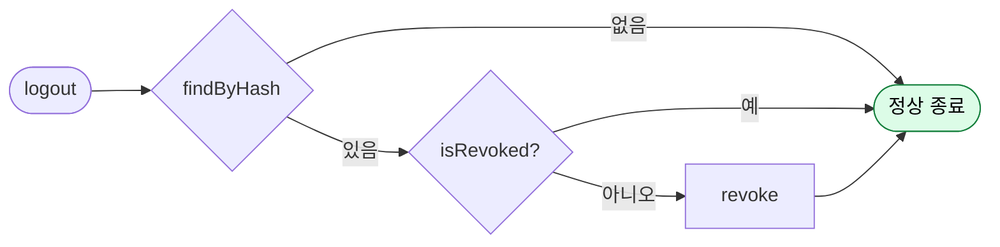

Access Token 은 무상태라 로그아웃해도 즉시 죽지 않는다 — 짧은 TTL 로 만료를 기다린다.

## 토큰을 해시로 찾는 원리

비밀번호 해싱(bcrypt)과 달리, 여기 해시는 **결정적(deterministic)** 이라 조회가 된다.

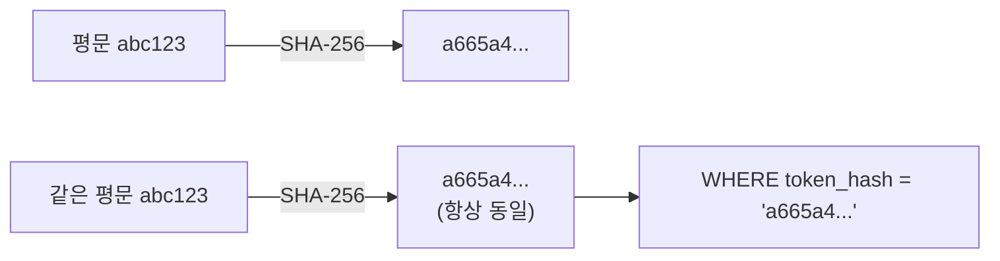

`RefreshToken.hashOfPlain` 은 salt 없는 순수 SHA-256 이다 → 같은 평문이면 언제나 같은 해시 → DB 컬럼과 정확히 일치 검색(`token_hash` UNIQUE).

| 방식 | 검색 | DB 유출 시 |
|---|---|---|
| 평문 저장 | O | 그대로 탈취 (최악) |
| **SHA-256 (현재)** | **O (결정적)** | 역산 불가 → 못 씀 |
| bcrypt/salt | X (매번 다름) | 안전하나 검색 불가 |

토큰 값 자체가 32바이트 랜덤이라 엔트로피가 충분 → 비밀번호와 달리 salt 없이도 무차별 대입이 사실상 불가. 그래서 "DB 조회는 해야 하는데 유출돼도 안전" 이라는 두 요구를 SHA-256 이 동시에 만족시킨다. 해시 알고리즘은 도메인(`RefreshToken`) 책임이라 어댑터가 직접 해시하지 않는다.

## Access Token 검증 — DB 0회 (무상태)

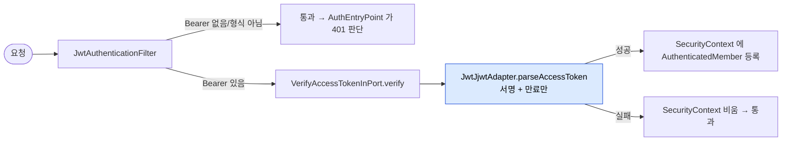

- 검증은 서버 메모리의 대칭키로 **서명 + 만료** 두 가지만 본다. `Repository`/`OutPort` 호출이 전혀 없다.
- 필터는 토큰이 잘못돼도 즉시 401 로 끊지 않는다 — permitAll 경로(`/api/v1/auth/google` 등)가 통과해야 하므로, 401 결정은 `AuthEntryPoint` 에 위임한다.
- 헥사고날 원칙: driving adapter(필터)는 OutPort 를 직접 부르지 않고 `VerifyAccessTokenInPort` 를 거친다. 검증 정책이 application 레이어 한 곳(`VerifyAccessTokenUseCase`)에 모여, 나중에 DB 조회를 끼울 때 필터를 안 건드린다.

## 데이터 모델 (Refresh Token)

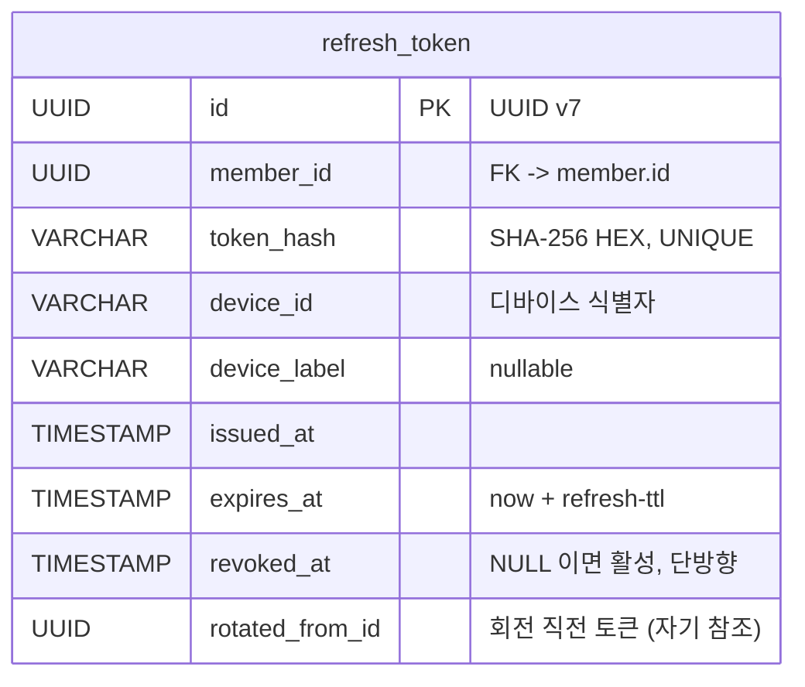

- `token_hash` 에 UNIQUE, `(member_id, device_id)` 와 `member_id` 에 인덱스.
- `rotated_from_id` 는 자기 참조지만 **외래키는 두지 않는다** — 일괄 회수 시 cascade 를 단순화하기 위함.
- `revoked_at` 은 단방향 — 한 번 채워지면 다시 비울 수 없다 (`revoke` 멱등).

---

## 예외 흐름 (공통)

로그인·회전·검증의 모든 비즈니스 예외는 **자기 `ResponseCode` 를 들고** 하나의 핸들러로 수렴한다.

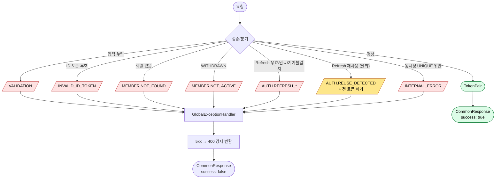

- **5xx 는 외부에 노출하지 않는다** — 항상 4xx 로 강제 변환해 내부 사정을 흘리지 않는다.
- 탈취 감지(`REUSE_DETECTED`)만은 예외를 던지면서도 **일괄 폐기를 커밋**한다 ([noRollbackFor](#트랜잭션-미묘함-norollbackfor) 참고).

## 트랜잭션 / 멱등성 경계

| UseCase | 트랜잭션 범위 | 멱등성 |
|---|---|---|
| `LoginWithGoogleUseCase` | Member/SocialIdentity 처리 + 기존 토큰 회수 + 신규 발급이 **한 트랜잭션** | — |
| `RefreshAccessTokenUseCase` | 옛 토큰 revoke + 새 토큰 save 가 **한 트랜잭션** (둘 다 커밋되거나 둘 다 롤백). 단, 탈취 분기의 일괄 폐기는 `noRollbackFor` 로 커밋 보장 | 회전은 비멱등 — 같은 평문 재사용 시 탈취로 처리 |
| `LogoutUseCase` | 단일 revoke | **멱등** — 없거나 이미 폐기돼도 정상 종료 |
| `VerifyAccessTokenUseCase` | 트랜잭션 없음 (DB 미접근) | — |

## 향후 확장

무상태 Access Token 의 본질적 한계: **발급된 순간부터 만료 전까지 무조건 유효**하다. Refresh Token 을 revoke 해도 이미 들고 있는 Access Token 은 만료(최대 15분)까지 산다. 그래서:

- Access Token TTL 을 **짧게(15분)** 둬서 탈취 노출 창을 줄인다.
- 즉시 무효화가 필요해지면 `VerifyAccessTokenUseCase` 에 조회를 추가한다 (이미 확장 자리로 주석에 명시):
  - WITHDRAWN 회원의 토큰 거부 (`MemberOutPort` 조회)
  - 토큰 블랙리스트 검증
  - 시크릿 회전 시각 이후 토큰만 허용
- **Kakao/Apple 추가** — 같은 `VerifiedSocialUser` 도메인 모델을 재사용. 새 OutPort + Adapter 만 추가하면 되고, 도메인 클래스/UseCase 본체와 Refresh 회전/탈취 감지 로직은 그대로 (Refresh Token 은 제공자와 무관).
- **자동 연결 race** — 현재는 `(provider, providerUserId)` UNIQUE 가 자연 차단. UX 요구가 생기면 명시적 충돌 처리로 확장.
