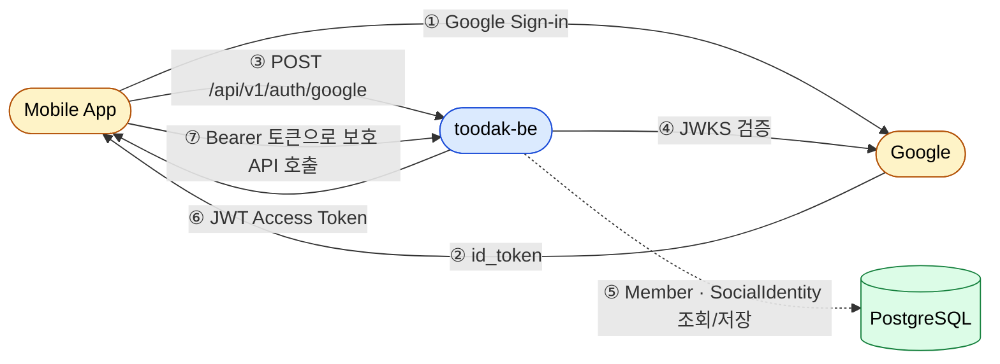
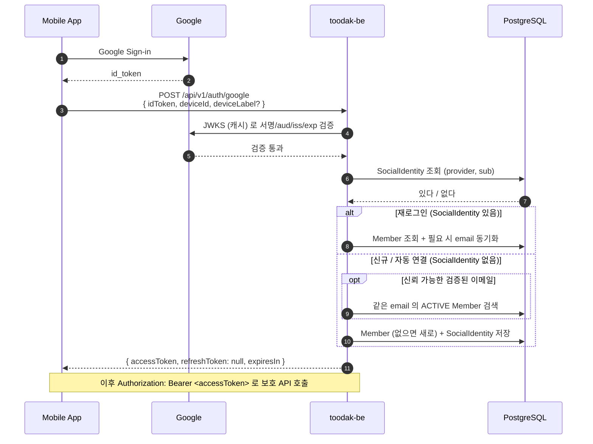
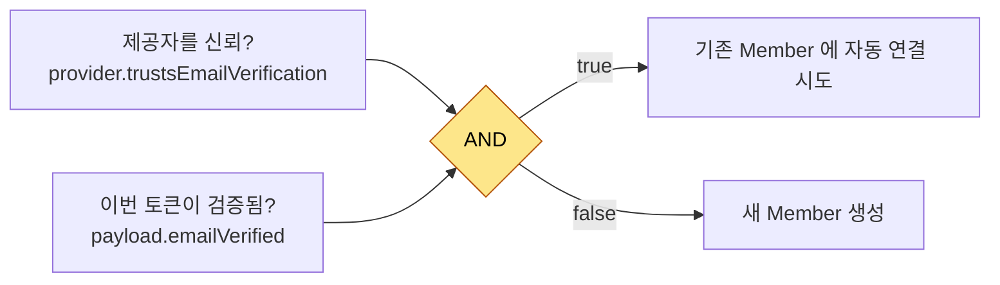
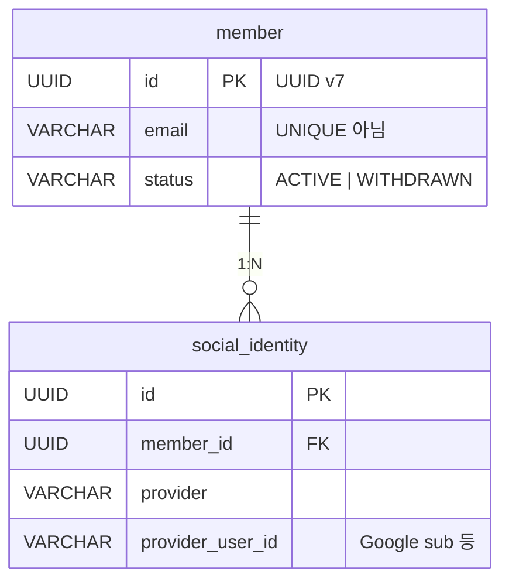
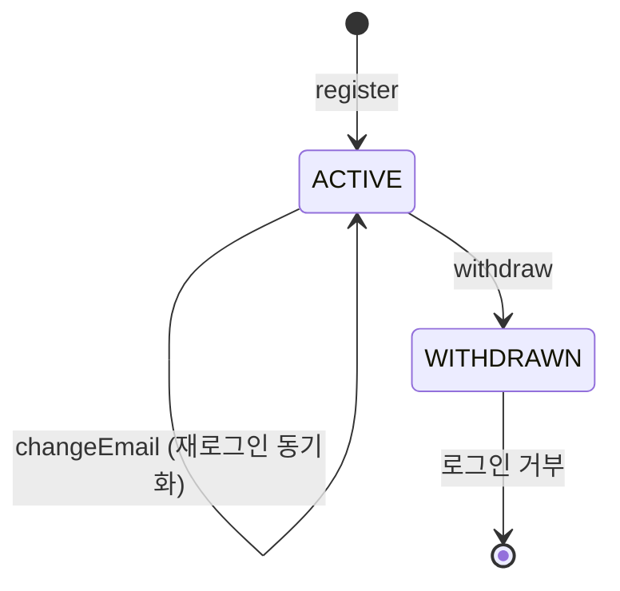
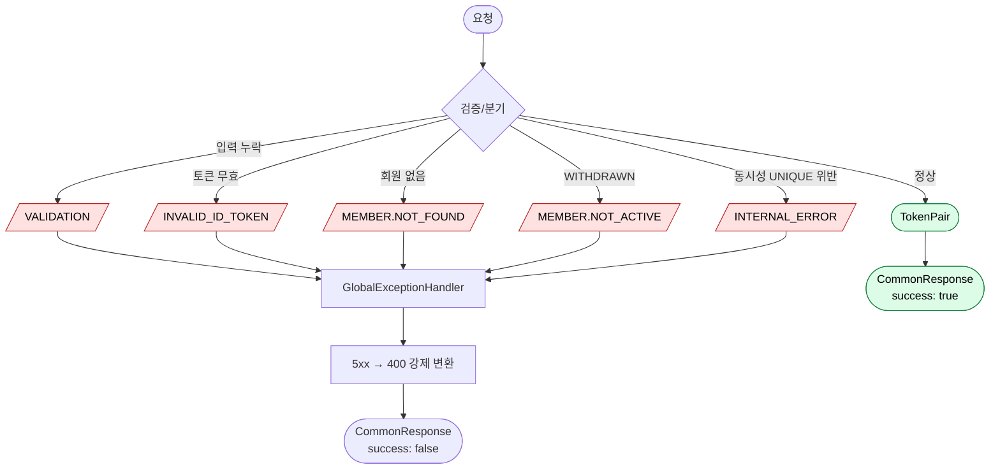
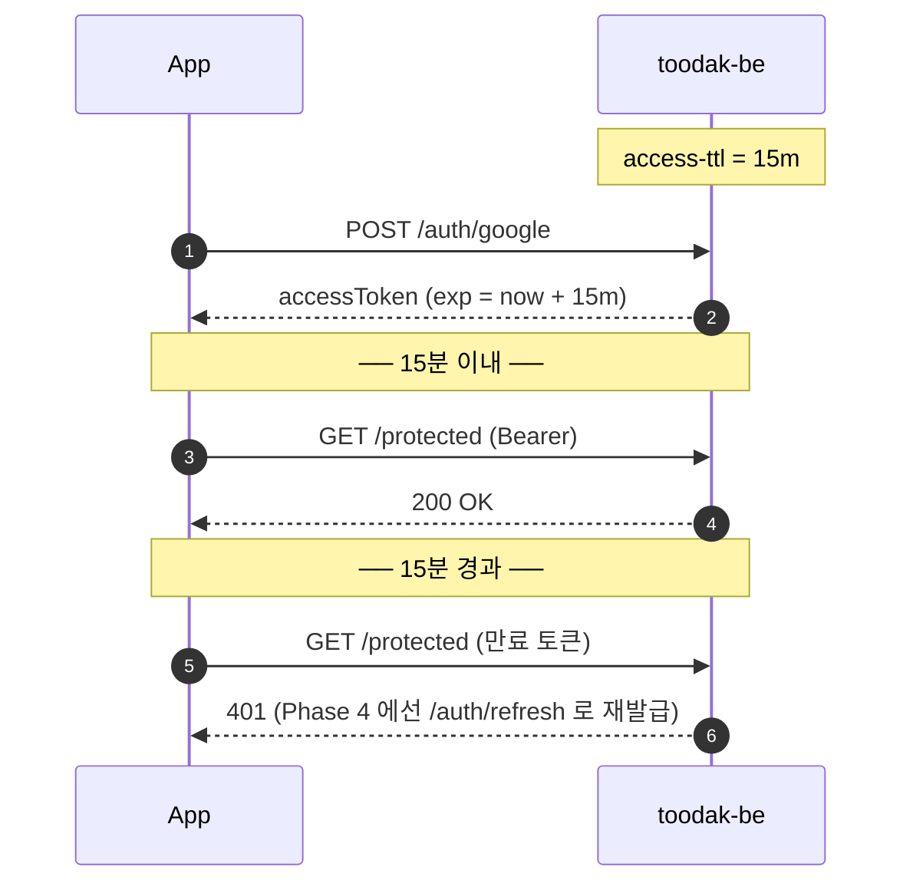

# Google OIDC 로그인 흐름

> Mobile 앱이 Google ID Token 으로 로그인/자동 가입하고, 서버가 자체 JWT Access Token 을 돌려주는 전체 흐름.
> 코드만 봐서는 잡히지 않는 **정책과 큰 그림** 만 적는다.

## 한눈에 보기

## 전체 시퀀스

## 분기 결정

`(provider, providerUserId)` 가 시스템 전체 UNIQUE 이므로, **이 한 번의 조회로 "재로그인 vs 신규" 가 갈린다.**

```mermaid
flowchart TD
    Start([검증된 소셜 사용자]) --> Find{기존 SocialIdentity?}

    Find -- 있음 --> R1{Member 존재?}
    R1 -- 없음 --> ExMNF[/MemberNotFoundException<br/>정합성 깨짐/]
    R1 -- 있음 --> R2{ACTIVE?}
    R2 -- 아님 --> ExMNA[/MemberNotActiveException<br/>WITHDRAWN 거부/]
    R2 -- 맞음 --> R3{email 변경됨?}
    R3 -- 예 --> Sync[Member email 동기화] --> Issue
    R3 -- 아니오 --> Issue

    Find -- 없음 --> Auto{자동 연결 조건<br/>충족?}
    Auto -- 예 --> ByEmail{같은 email<br/>ACTIVE Member?}
    ByEmail -- 예 --> Link[기존 Member 에 SocialIdentity 만 연결]
    ByEmail -- 아니오 --> NewBoth
    Auto -- 아니오 --> NewBoth[새 Member + SocialIdentity 생성]
    Link --> Issue
    NewBoth --> Issue

    Issue[Access Token 발급] --> Resp([200 OK])

    style ExMNF fill:#fee2e2,stroke:#b91c1c,color:#000
    style ExMNA fill:#fee2e2,stroke:#b91c1c,color:#000
    style Issue fill:#dcfce7,stroke:#15803d,color:#000
    style Resp  fill:#dcfce7,stroke:#15803d,color:#000
```

## 자동 연결 정책

신규 분기에서 같은 이메일의 기존 Member 에 새 SocialIdentity 를 자동으로 붙일지 결정하는 게이트.

- **두 신뢰 층의 AND**:
  - `trustsEmailVerification` — "이 **소스(제공자)** 를 신뢰하는가" (제공자 단위 정책)
  - `emailVerified` — "그 소스가 **이번에 뭐라고 말하는가**" (토큰 단위 사실)
- 한쪽만 통과하게 두면, 신뢰 안 하는 제공자가 가짜 `verified=true` 를 보내거나, 신뢰하는 제공자라도 미검증 이메일로 다른 사람 계정과 합쳐질 수 있다.
- 정책을 바꾸려면 `Provider` enum 한 곳만 손대면 된다.

## 데이터 모델

- **식별 키는 `(provider, provider_user_id)`**, email 이 아니다 — 이메일은 변동/공유 가능한 부가 정보.
- 그래서 `email` 에는 UNIQUE 를 걸지 **않고**, 동일 이메일 회원이 여러 명일 수 있다.

## Member 상태

- 탈퇴는 soft delete — 데이터는 보존, 로그인만 막힌다.
- SocialIdentity 는 한 번 연결되면 첫 연결 시점 그대로 보존 (재로그인 시 갱신하지 않음).

## 예외 흐름

- 모든 비즈니스 예외는 **자기 `ResponseCode` 를 들고 다니며** 하나의 핸들러로 수렴한다.
- **5xx 는 외부에 노출하지 않는다** — 항상 4xx 로 강제 변환해 내부 사정을 흘리지 않는다.

## Access Token 라이프사이클

- Access Token 은 **stateless** — 즉시 무효화 불가. 그래서 TTL 을 짧게(15분) 두고 RefreshToken 회전(Phase 4)으로 보완한다.

## Phase 4 이후

- **RefreshToken 회전 + 탈취 감지** — 응답의 `refreshToken: null` 자리를 채운다. 디바이스 단위 발급, 이미 revoked 된 토큰 재사용 시 해당 Member 의 **모든 RefreshToken 일괄 폐기**.
- **Kakao/Apple 추가** — 같은 `VerifiedSocialUser` 도메인 모델을 재사용. 새 OutPort + Adapter 만 추가하면 되고, 도메인 클래스/UseCase 본체는 그대로.
- **자동 연결 race** — 현재는 `(provider, providerUserId)` UNIQUE 가 자연 차단. UX 요구가 생기면 명시적 충돌 처리로 확장.
